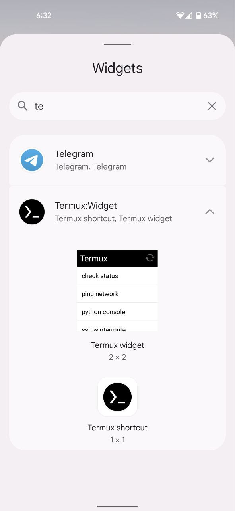
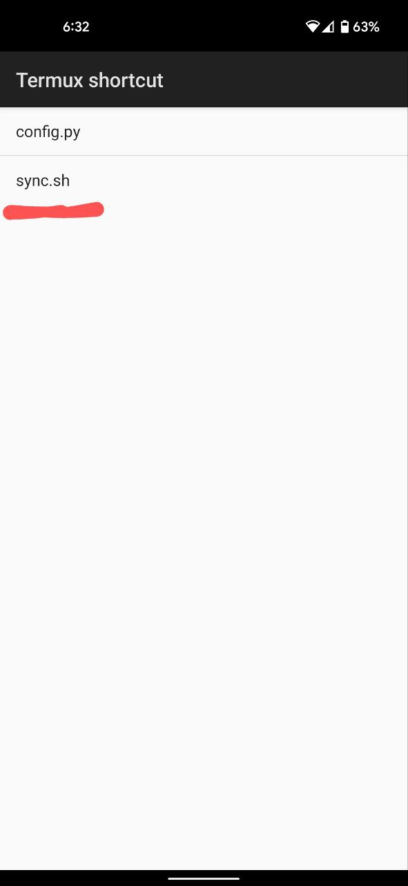
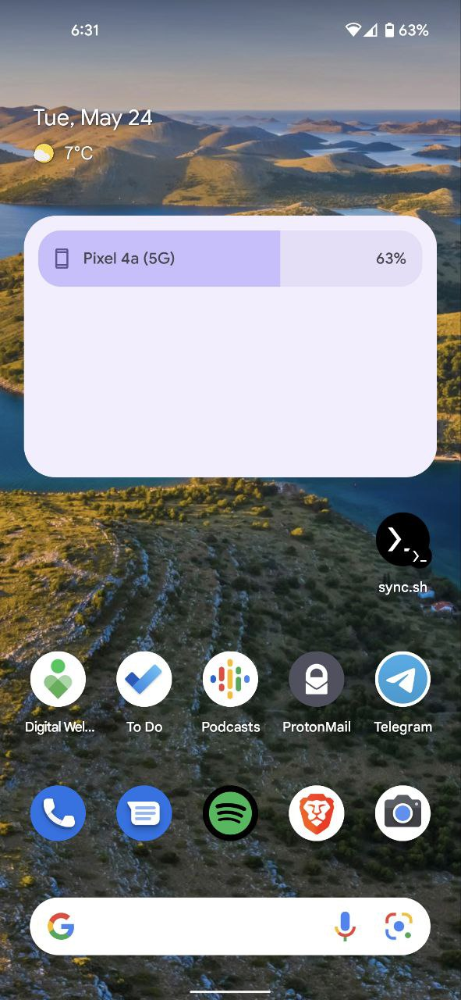
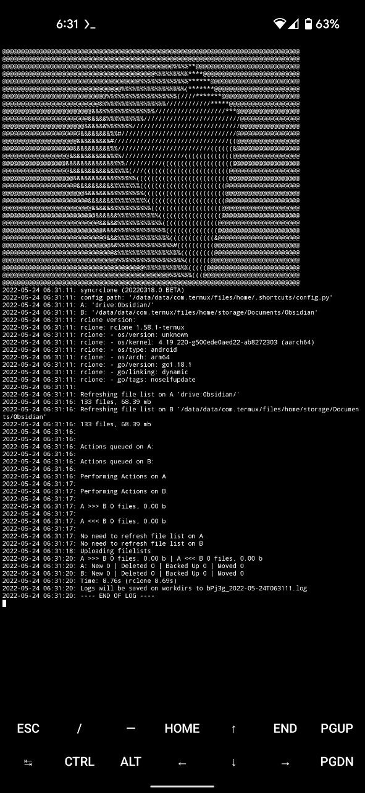

# obsidian android sync

## Note
- To be more secure please try to use your own Google Drive API keys
- Create a pull request to contribute
- To run it automatically in backgroud you can use crontab or something similar in Termux

### Setup

1. Install [Termux](https://termux.com) and [Termux:Widget](https://wiki.termux.com/wiki/Termux:Widget) from [F-Droid](https://f-droid.org/)

2.  Run in Termux

```shell
pkg update

pkg upgrade

pkg install git

git clone https://github.com/starfreck/obsidian-android-sync.git

mv obsidian-android-sync/* .

rm -rf obsidian-android-sync

chmod 777 -R .

./install.sh
```

3. Once you are done setting up 'rclone', we will update sync paths on config.py

4. python3 update_config.py "pathA" "pathB"

```shell
# Create a folder name 'Obsidian' in root of your Cloud Storage
# Replcae 'gdive' in below command with your given name i.e. 'mega' etc.
# Do not change '/storage/emulated/0/Documents/Obsidian' because Obsidian by default look into Documents folder

python3 ~/update_config.py "gdrive:Obsidian" "/storage/emulated/0/Documents/Obsidian"

# if you mess up then just use "syncrclone --new config.py" to create new config.py
```

5. Go to 'Widget' and add new Widget "Sync.sh. See the example [here](https://wiki.termux.com/wiki/Termux:Widget). After that click on new shortcut and your sync will start automatically.

## Screenshots






## Referance
- https://rclone.org
- https://rclone.org/drive/
- https://rclone.org/mega/
- https://wiki.termux.com/wiki/Main_Page
- https://github.com/Jwink3101/syncrclone
